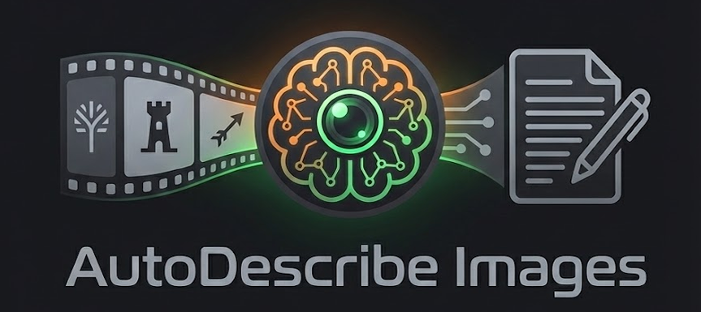

<p align="center">
  
</p>

# ollama-image-describer

Tool to automatically generate text descriptions (captions) for images using Ollama vision models (LLaVA, Qwen3-VL, Llama Vision). Available as a **web application** (recommended) or **CLI**.

**Key feature:** Fully customizable system prompts to precisely control the output format. Includes built-in presets optimized for Stable Diffusion (with parentheses weight syntax), Z-Image/Midjourney (detailed structured descriptions), Flux, and more.

## Use Case

**Perfect for AI image generation training!** This tool is designed to help you create caption files for training LoRA (Low-Rank Adaptation) models on image generation AI like Stable Diffusion, Flux, Z-Image, or other diffusion models.

When training a LoRA, each image in your dataset needs an accompanying `.txt` file with a description. This tool automates that process by:
- Analyzing each image with a vision AI model
- Generating detailed, consistent descriptions tailored to your target model
- Saving them as `.txt` files alongside your images
- Optionally adding a prefix/suffix (like artist name or style trigger word)

## Prerequisites

- **[Git](https://git-scm.com/)** - Version control
- **[uv](https://docs.astral.sh/uv/)** - Python package manager (handles Python installation automatically)
- **[Ollama](https://ollama.com/download)** - Must be installed separately and running

### Installing Git

Check if Git is already installed:

```bash
git --version
```

If not installed, download it from [git-scm.com](https://git-scm.com/downloads) and follow the installation instructions for your OS.

### Installing uv

**uv** is a fast Python package manager. First, check if you already have it installed:

```bash
uv --version
```

If not installed, run one of these commands:

```bash
# Windows (PowerShell)
powershell -ExecutionPolicy ByPass -c "irm https://astral.sh/uv/install.ps1 | iex"

# macOS / Linux
curl -LsSf https://astral.sh/uv/install.sh | sh
```

After installation, restart your terminal to ensure `uv` is available in your PATH.

### Installing Ollama

Download and install Ollama from [ollama.com](https://ollama.com/download), then pull a vision model:

```bash
ollama pull qwen3-vl:4b
```

## Installation

```bash
# Clone the repository
git clone https://github.com/hydropix/ollama-image-describer.git
cd ollama-image-describer

# Install Python dependencies with uv
uv sync
```

> **Note:** `uv sync` installs the Python dependencies (including the `ollama` Python client library). The Ollama server itself must be installed separately as described above.

## Configuration

### Environment Variables (.env)

Create a `.env` file from the example:

```bash
cp config/.env.example .env
```

Configure your Ollama server:

```env
OLLAMA_HOST=http://localhost:11434
OLLAMA_MODEL=qwen3-vl:4b
```

### Prompt Configuration (config/config.yaml)

The `config/config.yaml` file contains prompt presets and default settings. **The system prompt is fully customizable**, allowing you to precisely control the output format to match your specific needs.

#### Built-in Presets

The tool includes presets optimized for different image generation models:

| Preset | Target Model | Description |
|--------|--------------|-------------|
| **Z-Image** | Z-Image, Midjourney | Very detailed, structured descriptions with markdown formatting. Focuses on composition, lighting, textures, and atmosphere with poetic precision. |
| **Stable Diffusion** | SD, SDXL, Forge | Tag-based prompts with weight syntax `(element:1.2)`. Uses parentheses for emphasis and quality boosters like `(masterpiece:1.2), (best quality)`. |
| **Simple** | General use | Concise, straightforward descriptions without special formatting. |

#### Example: Stable Diffusion Preset Output

```
(masterpiece:1.2), (best quality), 1girl, long flowing red hair, (emerald green eyes:1.3),
elegant black dress, standing in flower field, soft golden hour lighting, (bokeh:1.1),
depth of field, vibrant colors, digital painting style, highly detailed
```

#### Example: Z-Image Preset Output

```markdown
## Subject
**Young woman** with flowing auburn hair, wearing a vintage emerald dress

## Composition & Setting
Wide shot capturing a sunlit meadow with wildflowers in the foreground

## Lighting & Atmosphere
*Golden hour lighting* casting warm shadows, *soft diffused glow* from the setting sun
```

#### Creating Custom Presets

Add your own presets in `config/config.yaml` to tailor outputs for your specific workflow:

```yaml
prompts:
  # Your custom preset
  flux:
    name: "Flux"
    markdownFormat: false
    prompt: |
      Generate a natural language description optimized for Flux models.
      Focus on clear, descriptive sentences without weight syntax.
      Describe the scene as if telling a story...

  my_custom:
    name: "My Custom Style"
    markdownFormat: false
    prompt: |
      Your custom instructions here...
      Be specific about the output format you want.

defaults:
  temperature: 0.7
  model: "qwen3-vl:4b"
```

The `markdownFormat` option controls whether the output uses markdown styling (headers, bold, italics) or plain text.

## Usage

> **Important:** All commands must be run from the project directory (`ollama-image-describer`).

### Web Interface (Recommended)

Launch the web interface for an easier experience:

```bash
cd ollama-image-describer
uv run python -m image_describer --web
```

### CLI Mode

```bash
uv run python -m image_describer <image_folder> [options]
```

### Options

| Option | Short | Description |
|--------|-------|-------------|
| `--web` | `-w` | Launch the web interface |
| `--config` | `-c` | Path to YAML config file |
| `--prefix` | `-p` | Text prepended to each description |
| `--suffix` | `-s` | Text appended to each description (e.g., ", By Artist") |
| `--overwrite/--no-overwrite` | | Overwrite existing .txt files (default: overwrite) |
| `--verbose` | `-v` | Verbose mode |

### Examples

```bash
# Launch web interface
uv run python -m image_describer --web

# Basic CLI usage
uv run python -m image_describer ./my_images

# With prefix and suffix
uv run python -m image_describer ./my_images --prefix "A photo of " --suffix ", By Kristof"

# Verbose mode with custom config
uv run python -m image_describer ./my_images -v -c custom_config.yaml
```

## Supported Models

> ⚠️ **Important:** This tool requires a **vision model** capable of analyzing images. Standard text-only models (like `llama3`, `mistral`, etc.) will not work.
>
> Browse all available vision models: [Ollama Vision Models](https://ollama.com/search?c=vision)

**Recommended vision models:**

- **Qwen3-VL** (recommended): `qwen3-vl:4b`
- **LLaVA**: `llava`, `llava:13b`
- **Llama Vision**: `llama3.2-vision`

## License

MIT
